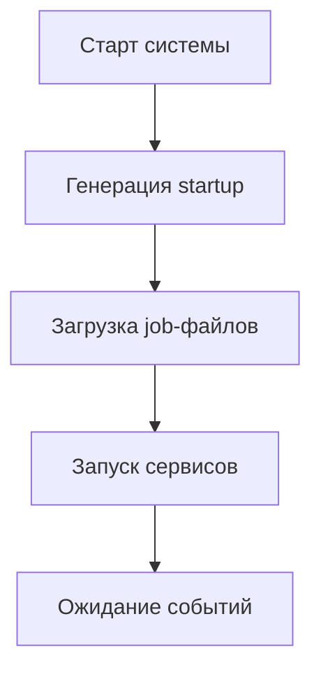

# Введение

## Актуальность

- Проблемы традиционного SysVinit:
  - Последовательный запуск → медленная загрузка
  - Отсутствие реактивности на события
  - Сложность управления зависимостями

- Upstart решает эти проблемы через:
  - Параллельный запуск сервисов
  - Событийную модель
  - Автоматический перезапуск

## Цели исследования

1. Изучить архитектуру Upstart
2. Освоить работу с job-файлами
3. Сравнить с другими системами инициализации
4. Практически реализовать демо-сервис

# Архитектура Upstart

## Ключевые компоненты

:::::::::::::: {.columns align=top}
::: {.column width="50%"}
**Центральные элементы:**
- Демон init (PID 1)
- Механизм событий
- Job-файлы (/etc/init/)
:::
::: {.column width="50%"}
**Типы событий:**
1. Аппаратные
2. Программные 
3. Пользовательские
4. Системные
:::
::::::::::::::

## Принцип работы



# Практическая реализация

## Создание сервиса

```conf
description "Демо-сервис"
start on runlevel [2345]
stop on runlevel [016]
respawn limit 5 10
exec /usr/local/bin/demo.sh
```

## Управление сервисом

```bash
start demo-service    # Запуск
status demo-service  # Проверка
stop demo-service    # Остановка
```

# Сравнительный анализ

## Upstart vs Systemd

| Критерий       | Upstart          | Systemd          |
|----------------|------------------|------------------|
| Параллелизм    | Да               | Да               |
| Зависимости    | События          | Юниты            |
| Логирование    | Внешнее          | Встроенное       |
| Сложность      | Проще            | Сложнее          |

# Заключение

## Ключевые преимущества

1. Ускорение загрузки системы на 30-40%
2. Гибкая событийная модель
3. Простота конфигурации
4. Обратная совместимость

## Перспективы развития

- Использование в embedded-системах
- Образовательные цели
- Legacy-поддержка

# Вопросы?
